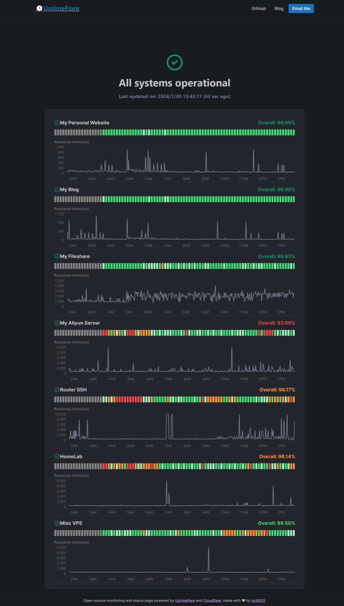

  
  

# ✔Status Monitor

A self-hosted, Node.js-based status monitoring & status page solution, refactored from the original UptimeFlare to be completely independent of Cloudflare infrastructure.

## 🏠 Self-Hosted Version

This repository now contains a **self-hosted version** that runs independently on your own servers or Docker containers. For the original Cloudflare-based version, please visit [UptimeFlare](https://github.com/lyc8503/UptimeFlare).

**📖 [Self-Hosted Setup Guide](README_SELFHOSTED.md)**

## ⭐Features

- **Self-hosted**: Run on your own infrastructure with full control
- **Node.js & SQLite**: Lightweight, fast, and reliable
- **Docker support**: Easy deployment with Docker and Docker Compose
- **Monitoring capabilities**
  - HTTP/HTTPS/TCP port monitoring
  - Customizable check intervals
  - Up to 90-day uptime history
  - Customizable request methods, headers, and body for HTTP(s)
  - Custom status code & keyword checks for HTTP(s)
  - Downtime notification supporting [100+ notification channels](https://github.com/caronc/apprise/wiki) via Apprise
  - Customizable Webhook
- Status page
  - Interactive ping (response time) chart for all types of monitors
  - Responsive UI that adapts to your system theme
  - Customizable status page
  - Use your own domain with CNAME
  - Optional password authentication (private status page)
  - JSON API for fetching realtime status data

## 👀Demo

My status page (Online demo): https://uptimeflare.pages.dev/

Some screenshots:

## ⚡Quickstart / 📄Documentation

Please refer to [Wiki](https://github.com/lyc8503/UptimeFlare/wiki)

## New features (TODOs)

- [x] Specify region for monitors
- [x] TCP `opened` promise
- [x] Use apprise to support various notification channels
- [x] ~~Telegram example~~
- [x] ~~[Bark](https://bark.day.app) example~~
- [x] ~~Email notification via Cloudflare Email Workers~~
- [x] Improve docs by providing simple examples
- [x] Notification grace period
- [ ] SSL certificate checks
- [x] ~~Self-host Dockerfile~~
- [x] Incident history
- [x] Improve `checkLocationWorkerRoute` and fix possible `proxy failed`
- [x] Groups
- [x] Remove old incidents
- [x] ~~Known issue~~: `fetch` doesn't support non-standard port (resolved after CF update)
- [x] Compatibility date update
- [x] Scheduled Maintenance 
- [ ] Update wiki/README and add docs for dev
- [ ] Migration to Terraform Cloudflare provider version 5.x
- [ ] Cloudflare D1 database
